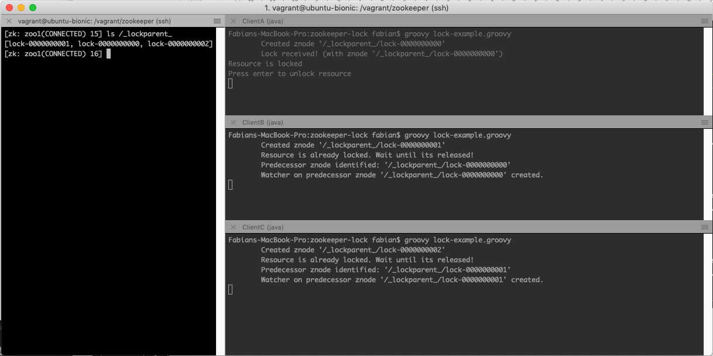
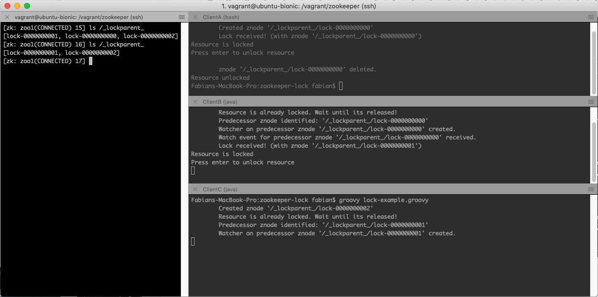

# ZooKeeper - A locking show-case implemented in groovy

## Motivation

As part of my Master studies I got the task to present the ZooKeeper service.
And what makes a presentation more interesting and demonstrates the functionality? A small **running** demonstration!

That it's why I decided to implement simple lock mechanism which is described on the [ZooKeeper website](https://zookeeper.apache.org/doc/r3.4.13/recipes.html#sc_recipes_Locks)

**Attention**: This code is written mainly to demonstrate the API of ZooKeeper and to show the mechanism of a simple lock
service. The code has been kept simple and should not be used for any other purpose.

 
## Preconditions
    
* A running groovy installation (can be easily installed with [sdkman](https://sdkman.io/))
    
* A running ZooKeeper service (e.g. within docker)
    ```
    docker run --name some-zookeeper --restart always -p 2181:2181 -d zookeeper:3.5
   ``` 

* Optional: The ZooKeeper CLI to see what's going on 
    ```
    docker run -it --rm --link some-zookeeper:zookeeper zookeeper:3.5 zkCli.sh -server zookeeper
    ```
    
## To run

Execute the grovvy script
    ```
    groovy lock-example.groovy
    ```

## A locking scenario

1. Three clients (Client A, B and C) are trying to lock the same Resource. Because the use the _Sequential_ flag ZooKeeper
    is appending a counter to the created nodes. The client with the lowest node (Client A) can acquire the lock, all the others
    have to wait and are therefore watching their predecessor node.

    

2. After client A releases the lock (deletes the node), client B is notified and is holding now the lock.

    

**Observation**: Only the next client in the row gets notified. All other clients are not waking up and are therefore not 
sending requests to ZooKeeper - the _herd effect_ is avoided! 
